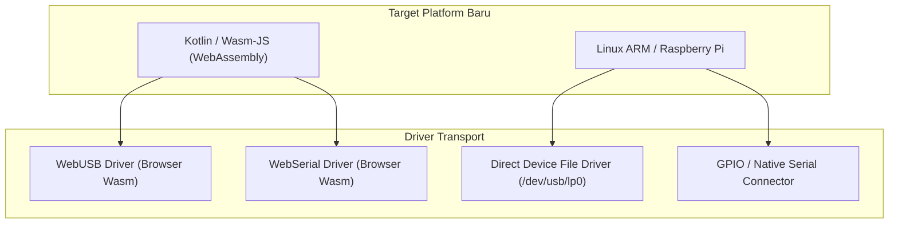

# ⚡ Rancangan Fitur: Dukungan Kiosk Mesin Antrean, IoT Raspberry Pi & Kotlin Wasm

**Status**: Planned / Ongoing  
**Target Module**: `:printer`  
**Target Platform**: Embedded Linux (Raspberry Pi/ARM), Web (Kotlin/Wasm & JS)  

---

## 📌 1. Latar Belakang & Tujuan
Ekosistem printer termal tidak hanya digunakan pada smartphone dan PC kasir, tetapi juga pada:
1. **Mesin Kiosk Mandiri (Self-Service Kiosk / ATM Antrean / Vending Machine)**: Berjalan di perangkat Linux ARM (Raspberry Pi, Orange Pi, Android POS built-in terminal) yang terhubung via Serial RS-232, GPIO, atau USB Device Path langsung (`/dev/ttyUSB0`, `/dev/usb/lp0`).
2. **Aplikasi Web Kasir Generasi Baru (WebAssembly / Wasm-JS)**: Kotlin/Wasm kini menjadi target utama untuk performa web setara native, memungkinkan browser berinteraksi langsung dengan printer via **WebUSB API** dan **Web Serial API**.

---

## 🏗️ 2. Desain Arsitektur Driver



---

## 💻 3. Contoh Desain API & Penggunaan

### A. Kiosk Linux / Raspberry Pi Direct Path
```kotlin
// Koneksi ke printer internal kiosk via direct device node Linux
val kioskPrinter = PrinterDevices.serial(
    name = "Kiosk Ticket Printer",
    portName = "/dev/usb/lp0",
    baudRate = 115200
)

val session = printer.openSession(kioskPrinter)
session.print {
    alignCenter()
    fontSize(3, 3)
    line("A-042")
    fontSize(1, 1)
    line("LOKET 1 - PENDAFTARAN")
    line("Waktu: 14:30 WIB")
    feed(3)
    cut()
}
```

### B. Kotlin/Wasm Browser Direct Printing
```kotlin
// Berjalan di browser berbasis Wasm dengan akses WebUSB/WebSerial native
val wasmPrinter = PrinterDevices.usb("WebPOS USB Printer", "USB_RAW:AUTO")

printer.print(wasmPrinter) {
    line("Cetak langsung dari Browser WebAssembly!")
    cut()
}
```

---

## 📋 4. Tahapan Implementasi (Checklist)
- [ ] Tambahkan target `wasmJs { browser() }` pada `printer/build.gradle.kts`.
- [ ] Implementasikan connector `WasmWebUsbConnector` dan `WasmWebSerialConnector` menggunakan interop JS/Wasm.
- [ ] Buat `LinuxDirectDeviceConnector` untuk akses langsung file `/dev/usb/lp*` atau `/dev/ttyUSB*` pada target JVM & Linux Native.
- [ ] Tambahkan konfigurasi flow control khusus untuk hardware printer kiosk (deteksi sensor kertas dekat habis / *paper near end sensor*).
- [ ] Uji coba build Kotlin/Wasm dan verifikasi integritas dependensi multiplatform.
