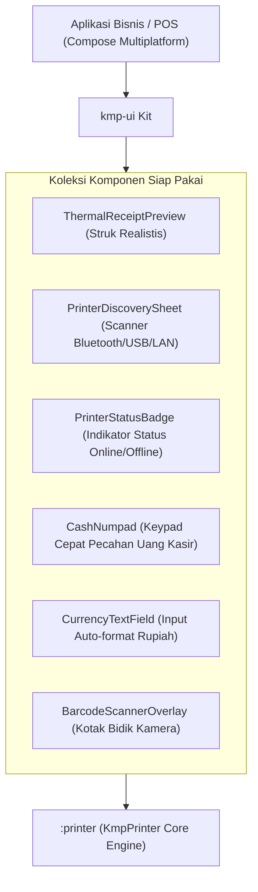

# 🎨 Rancangan Fitur: Modul UI Multiplatform (`kmp-ui`)

**Status**: Planned / Ongoing  
**Artifact ID**: `io.github.ringga-dev:kmp-ui`  
**Target Module**: `:kmp-ui` (atau `:ui`)  
**Target Platform**: Android, iOS, Desktop (JVM), Web (Wasm/JS)  

---

## 📌 1. Visi & Tujuan
`kmp-ui` adalah library komponen antarmuka (UI Component Kit) berbasis **Compose Multiplatform** yang dirancang untuk mempercepat pengembangan aplikasi bisnis, kasir (POS), retail, dan integrasi perangkat keras.

Modul ini **terpisah dari core library (`kmp_printer`)** sehingga pengguna yang hanya membutuhkan logika pencetakan tanpa UI tidak akan terbebani oleh dependensi Compose.

---

## 🏗️ 2. Arsitektur Multi-Module & Distribusi Maven

```
                         Maven Central Repository
                                    │
           ┌────────────────────────┴────────────────────────┐
           ▼                                                 ▼
┌──────────────────────────────────────┐  ┌──────────────────────────────────────┐
│       Core Library (Wajib/Dasar)     │  │       UI Component Kit (Opsional)    │
│   io.github.ringga-dev:kmp_printer   │  │       io.github.ringga-dev:kmp-ui    │
├──────────────────────────────────────┤  ├──────────────────────────────────────┤
│ • Ukuran: ~200 KB (Sangat Ringan)    │  │ • Membawa Compose Multiplatform UI   │
│ • Dependensi: 0 UI Lib (Pure KMP)    │  │ • Bergantung pada :kmp_printer       │
│ • Untuk: User yang bangun UI sendiri │  │ • Untuk: UI kasir & cetak instan     │
└──────────────────────────────────────┘  └──────────────────────────────────────┘
```

---

## 🧩 3. Komponen Utama `kmp-ui`



### A. Komponen Struk & Perangkat Keras
1. **`ThermalReceiptPreview`**: Widget tampilan kertas struk nyata (warna kertas gading, shadow, potongan zigzag, font monospace presisi).
2. **`PrinterDiscoverySheet`**: BottomSheet responsif pemilih printer dengan filter (Bluetooth/BLE, USB, Network) & penanganan permission otomatis.
3. **`PrinterStatusBadge`**: Chip status reaktif (*Online, Offline, Paper Out, Cover Open*).

### B. Komponen Transaksi & Kasir
4. **`CashNumpad`**: Keypad angka cepat dengan tombol pecahan otomatis (*Uang Pas, 50.000, 100.000, 200.000*).
5. **`CurrencyTextField`**: Input nominal harga yang otomatis memformat mata uang (misal: `Rp 150.000`).
6. **`BarcodeScannerOverlay`**: Kotak pemindai barcode / QR code dengan animasi garis pemindai laser.

---

## 💻 4. Contoh Penggunaan oleh Developer

### A. Hanya Membutuhkan Logika / Core (UI Buatan Sendiri)
```kotlin
// build.gradle.kts
commonMain.dependencies {
    implementation("io.github.ringga-dev:kmp_printer:2.4.0")
}
```

### B. Menggunakan Komponen Siap Pakai `kmp-ui`
```kotlin
// build.gradle.kts
commonMain.dependencies {
    implementation("io.github.ringga-dev:kmp-ui:2.4.0")
}
```

```kotlin
@Composable
fun PosCheckoutScreen(printer: KmpPrinter) {
    var showScanner by remember { mutableStateOf(false) }
    var amount by remember { mutableStateOf(0L) }

    Column(modifier = Modifier.padding(16.dp)) {
        // 1. Input nominal uang otomatis
        CurrencyTextField(
            value = amount,
            onValueChange = { amount = it },
            label = "Total Bayar"
        )

        // 2. Keypad kasir cepat
        CashNumpad(
            onAmountSelected = { amount = it },
            onQuickCashClick = { quickAmount -> amount += quickAmount }
        )

        // 3. Tombol cetak & pilih printer
        Button(onClick = { showScanner = true }) {
            Text("Pilih Printer & Cetak")
        }
    }

    if (showScanner) {
        PrinterDiscoverySheet(
            printer = printer,
            onDismiss = { showScanner = false },
            onDeviceSelected = { device ->
                showScanner = false
                // Langsung cetak
            }
        )
    }
}
```

---

## 📋 5. Tahapan Implementasi (Checklist)
- [ ] Daftarkan subproject Gradle `:kmp-ui` di `settings.gradle.kts`.
- [ ] Konfigurasi publikasi Maven terpisah untuk artefak `io.github.ringga-dev:kmp-ui`.
- [ ] Implementasikan `ThermalReceiptPreview` & `ReceiptPaperTheme`.
- [ ] Implementasikan `PrinterDiscoverySheet` & `PrinterStatusBadge`.
- [ ] Implementasikan `CashNumpad` & `CurrencyTextField`.
- [ ] Sediakan kustomisasi tema agar warna & tipografi dapat disesuaikan dengan *MaterialTheme* pengguna.
